Link to Jupyter Notebook on GitHub:

https://github.com/jakep3/Project-4/blob/master/Project_4_Philpott_Hydrophone.ipynb

Jake Philpott

BME 450

3/13/2020

                                        Project 4: Hydrophone Assignment

__PROBLEM STATEMENT__ 

There were two parts to this project. The purpose of the first part was to evaluate Hydrophone data from the OOI Broadband Hydrophone website and discover the effects of wind and rain on underwater noise. There were two sites of interest:
  1.	Oregon Shelf Cabled Benthic Experiment Package
  2.	Oregon Offshore Cabled Benthic Experiment Package

The purpose of the second part to this project was to find and evaluate short periods of time where there was marine mammal vocalization, airgun noise, and earthquake/volcano eruption noise. 

The two parts are described as follows: 

___Part 1:___

From Project 2, four time periods were to be identified and the corresponsding Power Spectral Density (PSD) vs Frequency plots were to be created. The four time periods of interest were as follows for both sites. 
  1. When it does not rain and it is not windy
  2. When it does not rain and it is windy
  3. When it rains and it is not windy
  4. When it rains and it is windy
  
After creating the eight plots, the following questions were to be answered:
  1. What is the effect of wind and rain on underwater noise? Explain any behavior you observe in your result.
  2. Which one has the highest impact? Rain or wind? 
  3. What are the main reasons for observing different spectral levels in Oregon shelf compared to Oregon offshore?

___Part 2:___

The following tasks were to be performed and questions answered. 

  1. Find a short time period that there is a marine mammal vocalization in recorded data and plot its spectrogram.
  2. Find a short time period that there is an airgun noise in recorded data and plot its spectrogram.
  3. Find a short time period that there is an earthquake or a volcano eruption in recorded data and plot its spectrogram.
  4. Compare the bandwidth of these three signals. Are they consistent with what is shown in the Wenz curve?

__BACKGROUND__ 

The following is helpful background information for the project. 

* Hydrophones are sensors that detect soundwaves underwater and turn them into an electric signal that can be read and evaluated. Hydrophone data for the project is available for use at the OOI Broadband Hydrohone website [1]. 

* This is the Wenz Curve, which provides expected frequencies and spectrum levels for various sources of noise underwater. It can be seen as follows. 

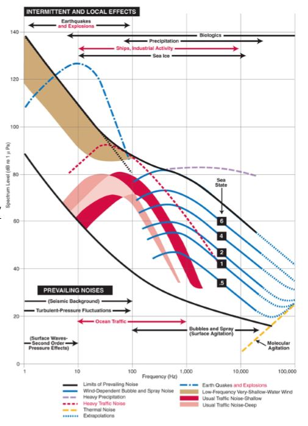

__Wenz Curve__: The Wenz Curve for ocean noise [2]. 

* Power spectral density (PSD) of a signal is the spectra level, which gives the mean-squared pressure of noise measured within a freqency bandwidth, divided by the measurement of bandwidth. It is essentially a measure of the signal's power versus frequency. The equation is used in the code related to this project. 

The equation is: 
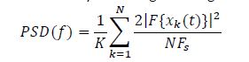

To obtain the PSD in units of decibels, the following equation is used: 
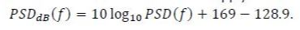

* The wind and rain time periods of interest were from Project 2 and this is the link: https://github.com/jakep3/Project-2-

* Airguns are used to create bubbles under water, which creates sound (pressure) waves when the bubbles are collapsed by the water pressure. The airguns are used during seismic reflection surveys and the sound waves can be detected by hydrophones. 

__SOLUTION__

Solution involved evaluating the data from Project 2 to determine the specific times that the four weather conditions were met. Then from the OOI Website, the corresponding Hydrophone data was able to be found and linked to Jupyter notebook for evaluation. 

The code involved can be seen in the link in the begining of the report. 
Once the plots were made, the questions of interest for the project were able to be answered through plot analysis. 

__RESULTS__

___Part 1 Results___

The following are the PSD vs Frequency plots (Figures 1 - 8) for the four time periods, for both sites, that were identified in Project 2.   

__Figure 1:__  When it does not rain and it is not windy, at the Oregon Shelf site. 

 
 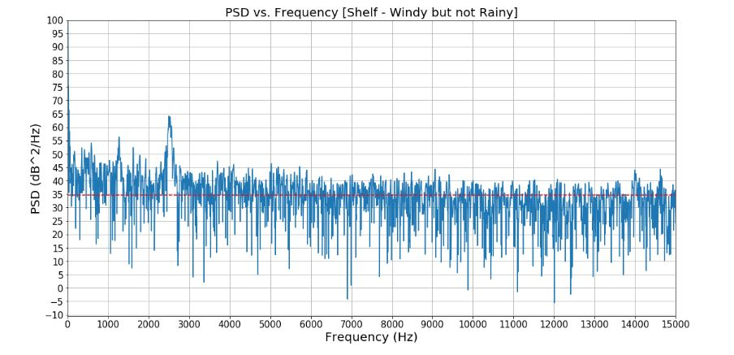
__Figure 2:__ When it does not rain and it is windy, at the Oregon Shelf site. 

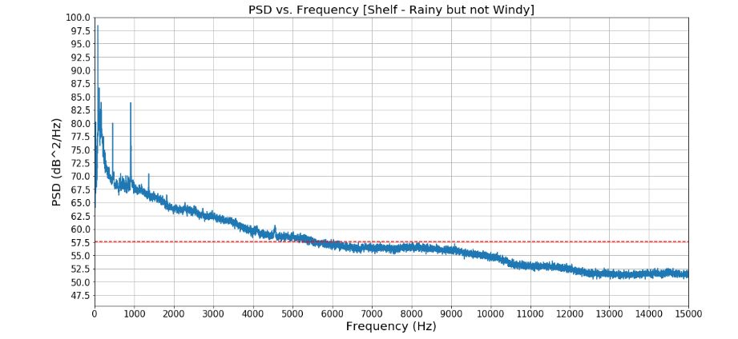
__Figure 3:__ When it rains and it is not windy, at the Oregon Shelf site. 

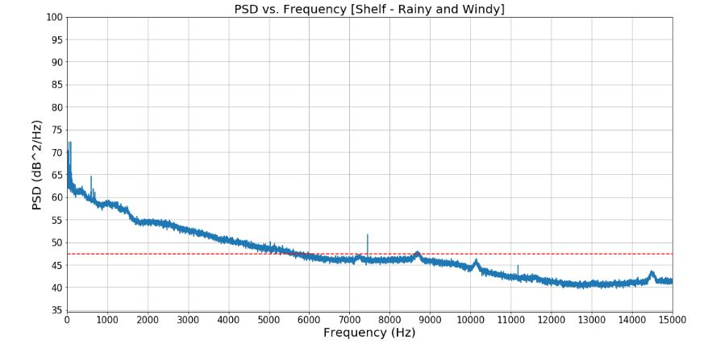
__Figure 4:__ When it rains and it is windy, at the Oregon Shelf site. 

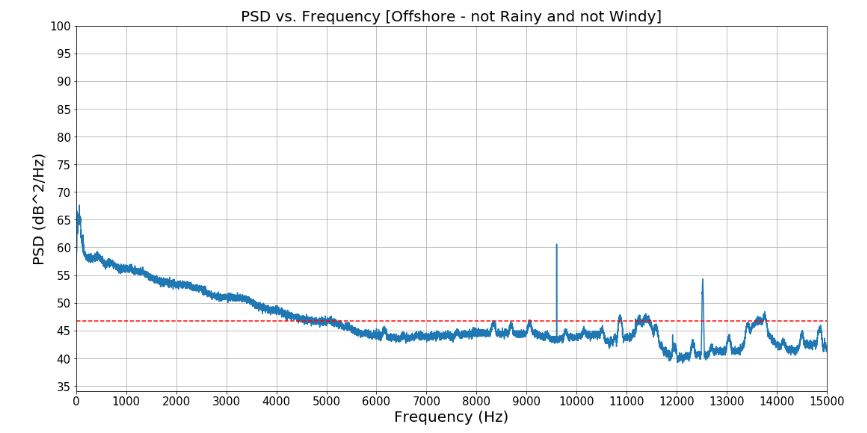
__Figure 5:__ When it does not rain and it is not windy, at the Oregon Offshore site. 

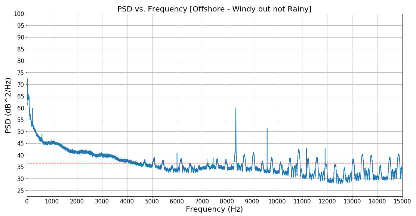
__Figure 6:__ When it does not rain and it is windy, at the Oregon Offshore site. 

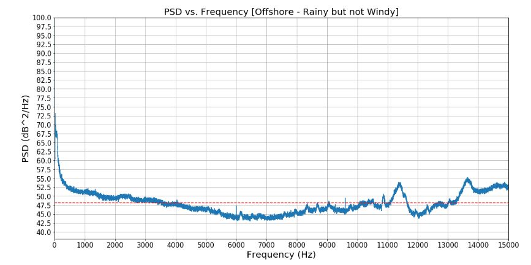
__Figure 7:__ When it rains and it is not windy, at the Oregon Offshore site. 

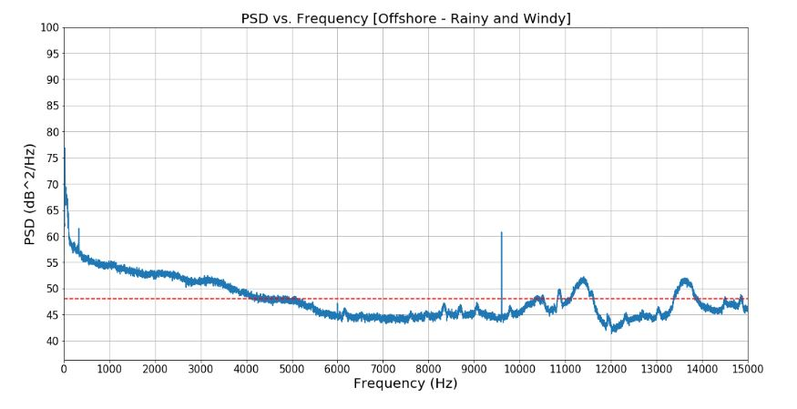
__Figure 8:__ When it rains and it is windy, at the Oregon Offshore site. 

Refering to the previous plots, the questions were answered as follows: 

 1. What is the effect of wind and rain on underwater noise? Explain any behavior you observe in your result.
    
 2. Which one has the highest impact? Rain or wind? 
    
 3. What are the main reasons for observing different spectral levels in Oregon shelf compared to Oregon offshore?
    

___Part 2 Results___

The following are the results from part 2 of the project. 

  1. There is a marine mammal vocalization recorded on the RS01SLBS device on October 6th 2017. The spectrogram of the recorded data can be seen in Figure 9. 
    
   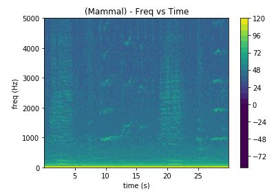
    
__Figure 9:__ Spectrogram for a short period of time that there is marine mammal vocalization. 

  2. There is airgun noise at the Asial Seabase RS03AXBS site on August 1st 2019. The spectrogram of the recorded data can be seen in Figure 10. 
    
  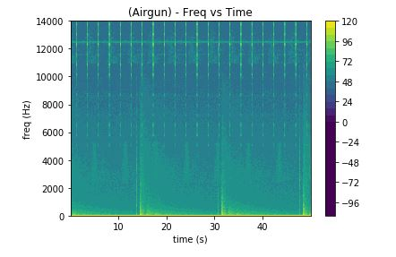
    
__Figure 10:__ Spectrogram for a short period of time that there is airgun noise. 

  3. There was earthquake/volcano eruption activity at the Axial seamount CE04OSBP site on April 15th 1017. The spectrogram of the recorded data can be seen in Figure 11.
    
  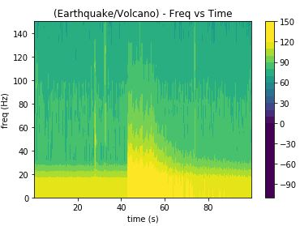
    
__Figure 11:__ Spectrogram for a short period of time that there is an earthquake or volcano eruption. 
 

4.  For Figure 9, the bandwidth for the marine mammal vocalization ranges from roughly 20 Hz to 5000+ Hz. This is consistent with  what is shown in the Wenz Curve, under Biologics. Biologics is the category that marine life noise is under and ranges from 10 Hz to 100000 Hz. For Figure 10, the bandwidth of the airguns appear to range from 0 Hz to 14000+ Hz every 15 seconds, and every 2 seconds they range from 6000 Hz to 14000+ Hz. Airguns produce their sound waves by making bubbles underwater. This is consistent with the Wenz Curve, under the category of Bubbles and Spray (Surface Agitation) and has a range of 100 Hz to roughly 100000 Hz.  For Figure 11, the bandwidth for the earthquake/volcano eruption is roughly 1 Hz to 100 Hz, with the most intense sound at from 20 Hz to 50 Hz. This is consistent with what is shown in the Wenz curve, under the category Earthquakes and Explosions, which range from 1 Hz to 100 Hz.

   
__CONCLUSIONS__ 

 
__REFERENCES__

OOI WEBSITE: https://oceanobservatories.org/instrument-series/hydbba/
Wenz Curve URL : https://dosits.org/science/sounds-in-the-sea/what-are-common-underwater-sounds/

