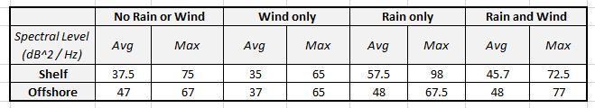

Link to Jupyter Notebook on GitHub:

https://github.com/jakep3/Project-4/blob/master/Project_4_Philpott_Hydrophone.ipynb

Jake Philpott

BME 450

3/13/2020

                                        Project 4: Hydrophone Assignment

__PROBLEM STATEMENT__ 

There were two parts to this project. The purpose of the first part was to evaluate Hydrophone data from the OOI Broadband Hydrophone website and discover the effects of wind and rain on underwater noise. There were two sites of interest:
  1.	Oregon Shelf Cabled Benthic Experiment Package
  2.	Oregon Offshore Cabled Benthic Experiment Package

The purpose of the second part to this project was to find and evaluate short periods of time where there was marine mammal vocalization, airgun noise, and earthquake/volcano eruption noise. 

The two parts are described as follows: 

___Part 1:___

From Project 2, four time periods were to be identified and the corresponding Power Spectral Density (PSD) vs Frequency plots were to be created. The four time periods of interest were as follows for both sites. 
  1. When it does not rain and it is not windy
  2. When it does not rain and it is windy
  3. When it rains and it is not windy
  4. When it rains and it is windy
  
After creating the eight plots, the spectra levels were to be compared and the following questions were to be answered:
  1. What is the effect of wind and rain on underwater noise? Explain any behavior you observe in your result.
  2. Which one has the highest impact? Rain or wind? 
  3. What are the main reasons for observing different spectral levels in Oregon shelf compared to Oregon offshore?

___Part 2:___

The following tasks were to be performed and questions answered. 

  1. Find a short time period that there is a marine mammal vocalization in recorded data and plot its spectrogram.
  2. Find a short time period that there is an airgun noise in recorded data and plot its spectrogram.
  3. Find a short time period that there is an earthquake or a volcano eruption in recorded data and plot its spectrogram.
  4. Compare the bandwidth of these three signals. Are they consistent with what is shown in the Wenz curve?

__BACKGROUND__ 

The following is helpful background information for the project. 

* Hydrophones are sensors that detect soundwaves underwater and turn them into an electric signal that can be read and evaluated. Hydrophone data for the project is available for use at the OOI Broadband Hydrophone website [1]. 

* This following is the Wenz Curve, which provides expected frequencies and spectrum levels for various sources of noise underwater.

__Wenz Curve__: The Wenz Curve for ocean noise [2]. 

* Power spectral density (PSD) of a signal is the spectra level, which gives the mean-squared pressure of noise measured within a frequency bandwidth, divided by the measurement of bandwidth. It is essentially a measure of the signal's power versus frequency. The equation is used in the code related to this project. 

The equation is: 

To obtain the PSD in units of decibels, the following equation is used: 

* The wind and rain time periods of interest were from Project 2 and this is the link: https://github.com/jakep3/Project-2-

* Airguns are used to create bubbles under water, which creates sound (pressure) waves when the bubbles are collapsed by the water pressure. The airguns are used during seismic reflection surveys and the sound waves can be detected by hydrophones. 

__SOLUTION__

For part one, the solution involved evaluating the data from Project 2 for both the Oregon Shelf and Oregon Offshore sites, to determine the specific timeframes that the four weather conditions were met. Once those specific timeframes were determined, the corresponding hydrophone data from the OOI website was found and evaluated in Jupyter Notebook. Evaluation involved finding the sampling rate, and using a function that solves the PSD and converts the PSD to decibels. Then, the function plots the PSD vs frequency in each site, for the four weather condition timeframes. Once the plots were made, the questions of interest were able to be answered through plot analysis. 

For part two, the solution involved using given timeframes for the mammal noise and airgun noise, and then using the corresponding hydrophone data from the OOI Website. The earthquake timeframe was found through google searches for underwater earthquakes and eruptions. Once one was found, the corresponding hydrophone data from the OOI website was used. Jupyter notebook was used to create plots of spectrograms for each of the three cases. This was done by using code that was provided, and modifying it to frame the frequencies that represent the data best. Once the plots were made, they were able to be compared to the Wenz Curve to check for consistency. 

Please see the Jupyter Notebook link at the beginning of the report if interested in the code. 

__RESULTS__

___Part 1 Results___

The following are the PSD vs Frequency plots (Figures 1 - 8) for the four time periods, for both sites, that were identified in Project 2.   

__Figure 1:__  When it does not rain and it is not windy, at the Oregon Shelf site. 

 
 
__Figure 2:__ When it does not rain and it is windy, at the Oregon Shelf site. 

__Figure 3:__ When it rains and it is not windy, at the Oregon Shelf site. 

__Figure 4:__ When it rains and it is windy, at the Oregon Shelf site. 

__Figure 5:__ When it does not rain and it is not windy, at the Oregon Offshore site. 

__Figure 6:__ When it does not rain and it is windy, at the Oregon Offshore site. 

__Figure 7:__ When it rains and it is not windy, at the Oregon Offshore site. 

__Figure 8:__ When it rains and it is windy, at the Oregon Offshore site. 

Referring to the previous plots, knowing that PSD is the spectral levels, the questions were answered as follows: 

 1. What is the effect of wind and rain on underwater noise? Explain any behavior you observe in your result.
     * Effect of wind: Wind does not appear to have much of an effect on the spectral level. However, based on the plots and values recorded in Table 1, Wind does not seem to increase the spectral level, and may even decrease it based on the average and maximum values found for Wind only compared to No Rain or Wind. During the Rain and Wind time, the average and maximum values are lower than Rain only and higher than no Rain or Wind, which further suggests that wind decreases the spectral level. This is true for both the Shelf and Offshore sites.  
     * Effect of rain:  Rain appears to increase the spectral level. Based on the plots and the values recorded in Table 1, the average and maximum spectral levels are higher for the Rain only time, compared to the No Rain or Wind. This is true for both the Shelf and Offshore sites. 
    
 2. Which one has the highest impact? Rain or wind? 
    * It appears that rain has the highest impact since it causes the most increase in the spectral value. As can be seen in Table 1. For example at the Shelf site, when it is not raining and not windy the max spectral level is 75, and then when it is raining the max spectral level is 98. At the Offshore site, when it is not raining and not windy the max spectral level is 67, and then when it is raining the max spectral level is 67.5. This is compared to the wind only maximum spectral level being 65 for both sites. 
 
 3. What are the main reasons for observing different spectral levels in Oregon shelf compared to Oregon offshore?
    * The two sites are at different depths. The Oregon Shelf Cabled site is at a depth of 80m, while the Oregon Offshore Cabled site is at a depth of 580m. The two sites will observe different spectral levels because the same sound waves will not necessarily be able to travel to both of the sites at the different depths. Higher frequencies will often be absorbed faster in the water and are unable to make it to the lower depths. Low frequencies will travel deep in the ocean, and the plots in Figures 1-8 support this and indicate that there is a lot of the lower frequencies since the lower frequencies all have higher spectral values per plot. The sound attenuation is the main reason for the observing different spectral levels. 
 
    
 
  
  __Table 1:__ A table gathering the approximate average and maximum spectral values for the shelf site and offshore sites. The values collected are from analyzing Figures 1 through 8. See Figures 1 through 8 to see the plotted data. 

___Part 2 Results___

The following are the results from part 2 of the project. 

  1. There is a marine mammal vocalization recorded on the RS01SLBS device on October 6th 2017. The spectrogram of the recorded data can be seen in Figure 9. 
    
   
    
__Figure 9:__ Spectrogram for a short period of time that there is marine mammal vocalization. 

  2. There is airgun noise at the Axial Seabase RS03AXBS site on August 1st 2019. The spectrogram of the recorded data can be seen in Figure 10. 
    
  
    
__Figure 10:__ Spectrogram for a short period of time that there is airgun noise. 

  3. There was earthquake/volcano eruption activity at the Axial Seamount CE04OSBP site on April 15th 2017. The spectrogram of the recorded data can be seen in Figure 11.
    
  
    
__Figure 11:__ Spectrogram for a short period of time that there is an earthquake or volcano eruption. 
 

4.  For Figure 9, the bandwidth for the marine mammal vocalization ranges from roughly 20 Hz to 5000+ Hz. This is consistent with  what is shown in the Wenz Curve, under Biologics. Biologics is the category that marine life noise is under and ranges from 10 Hz to 100000 Hz. For Figure 10, the bandwidth of the airguns appear to range from 0 Hz to 14000+ Hz every 15 seconds, and every 2 seconds they range from 6000 Hz to 14000+ Hz. Airguns produce their sound waves by making bubbles underwater. This is consistent with the Wenz Curve, under the category of Bubbles and Spray (Surface Agitation) and has a range of 100 Hz to roughly 100000 Hz.  For Figure 11, the bandwidth for the earthquake/volcano eruption is roughly 1 Hz to 100 Hz, with the most intense sound at from 20 Hz to 50 Hz. This is consistent with what is shown in the Wenz curve, under the category Earthquakes and Explosions, which range from 1 Hz to 100 Hz.

   
__CONCLUSIONS__ 

There were two parts to this project. The purpose of the first part was to evaluate Hydrophone data from the OOI Broadband Hydrophone website and discover the effects of wind and rain on underwater noise. The purpose of the second part to this project was to find and evaluate short periods of time where there was marine mammal vocalization, airgun noise, and earthquake/volcano eruption noise. PSD vs frequency plots were created which were able to be evaluated to understand the effects of wind and rain. It appears that the relation is both wind and rain create more noise underwater. It appears that the wind may decrease the spectral level, and it appears that the rain increases the spectral level. The wind has the greater effect on the underwater noise levels. Also, it is apparent that different depths are affected differently by the wind and rain at the surface. This is important because it allows us to know how we may affect animals at depth with airgun noise, ships, and other noises. The spectrograms were created for part two in order to observe sounds in the water at different frequencies and relate them to the Wenz Curve. The Wenz Curve is a valuable tool that allows for understanding frequencies of various events underwater. Hydrophone data is very valuable and provides a lot of information about ocean activities, marine life, and more. 
 
 
__REFERENCES__

[1] 	"HYDBBA - Broadband Acoustic Receiver (Hydrophone)," Ocean Observatories Initiative, [Online]. Available: https://oceanobservatories.org/instrument-series/hydbba/. [Accessed 14 March 2020].

[2] 	"What are common underwater sounds?," Discovery of Sound in the Sea, [Online]. Available: https://dosits.org/science/sounds-in-the-sea/what-are-common-underwater-sounds/. [Accessed 14 March 2020].
