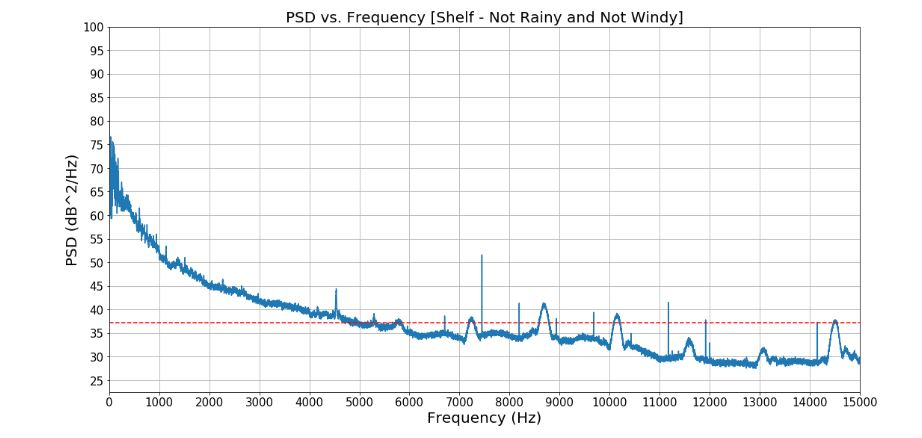

Link to Jupyter Notebook on GitHub:
https://github.com/jakep3/Project-4/blob/master/Project_4_Philpott_Hydrophone.ipynb

Jake Philpott

BME 450

3/13/2020

                                        Project 4: Hydrophone Assignment

__PROBLEM STATEMENT__ 

The purpose of this project was to evaluate Hydrophone data from the OOI Broadband Hydrophone website and discover the effects of wind and rain on underwater noise. There were two sites of interest:
  1.	Oregon Shelf Cabled Benthic Experiment Package
  2.	Oregon Offshore Cabled Benthic Experiment Package

___PART 1:___
From Project 2, four time periods were to be identified and the corresponsding Power Spectral Density (PSD) vs Frequency plots were to be created. The four time periods of interest were as follows for both sites. 
  1. When it does not rain and it is not windy
  2. When it does not rain and it is windy
  3. When it rains and it is not windy
  4. When it rains and it is windy
  
After creating the plots, the following questions were to be answered:
  1. What is the effect of wind and rain on underwater noise? Explain any behavior you observe in your result.
  2. Which one has the highest impact? Rain or wind? 
  3. What are the main reasons for observing different spectral levels in Oregon shelf compared to Oregon offshore?

___PART 2:___

The following tasks were to be performed and questions answered. 

  1. Find a short time period that there is a marine mammal vocalization in recorded data and plot its spectrogram.
  2. Find a short time period that there is an airgun noise in recorded data and plot its spectrogram.
  3. Find a short time period that there is an earthquake or a volcano eruption in recorded data and plot its spectrogram.
  4. Compare the bandwidth of these three signals. Are they consistent with what is shown in the Wenz curve?

__BACKGROUND__ 

Hydrophones do this...

Hydrophone data is available at this website : https://oceanobservatories.org/instrument-series/hydbba/

This is the Wenz curve from Ocean Noise Slides ... 

Power spectral density of a signal uses this equation ... 

Project 2 link is here and is where times came from : https://github.com/jakep3/Project-2-

__SOLUTION__

Solution involved evaluating the data from Project 2 to determine the specific times that the four weather conditions were met. Then form the OOI Website, the corresponding Hydrophone data was able to be found and linked to Jupyter notebook for evaluation. 

The code involved can be seen in the link in the begining of the report. 
Once the plots were made, the questions of interest for the project were able to be answered through plot analysis. 

__RESULTS__

___PART 1 RESULTS___

The following are the PSD vs Frequency plots (Figures 1 - 8) for the four time periods, for both sites, that were identified in Project 2.   

__Figure 1:__  When it does not rain and it is not windy, at the Oregon Shelf site. 

 
 
__Figure 2:__ When it does not rain and it is windy, at the Oregon Shelf site. 

__Figure 3:__ When it rains and it is not windy, at the Oregon Shelf site. 

__Figure 4:__ When it rains and it is windy, at the Oregon Shelf site. 

__Figure 5:__ When it does not rain and it is not windy, at the Oregon Offshore site. 

__Figure 6:__ When it does not rain and it is windy, at the Oregon Offshore site. 

__Figure 7:__ When it rains and it is not windy, at the Oregon Offshore site. 

__Figure 8:__ When it rains and it is windy, at the Oregon Offshore site. 

Refering to the previous plots, the questions were answered as follows: 

 1. What is the effect of wind and rain on underwater noise? Explain any behavior you observe in your result.
    
 2. Which one has the highest impact? Rain or wind? 
    
 3. What are the main reasons for observing different spectral levels in Oregon shelf compared to Oregon offshore?
    

___PART 2___
The following are the results from part 2 of the project. 

  1.Find a short time period that there is a marine mammal vocalization in recorded data and plot its spectrogram.
    i. The time and location was ....
    
   
    
__Figure 9:__ Spectrogram for a short period of time that there is marine mammal vocalization. 

  2. Find a short time period that there is an airgun noise in recorded data and plot its spectrogram.
    i. The time and location was ...
    
    
  
    
__Figure 10:__ Spectrogram for a short period of time that there is airgun noise. 

  3. Find a short time period that there is an earthquake or a volcano eruption in recorded data and plot its spectrogram.
    i. The time and location was ...
    
  
    
__Figure 11:__ Spectrogram for a short period of time that there is an earthquake or volcano eruption. 
 

   4. Compare the bandwidth of these three signals. Are they consistent with what is shown in the Wenz curve?
   
   
__CONCLUSIONS__ 

 
__REFERENCES__
